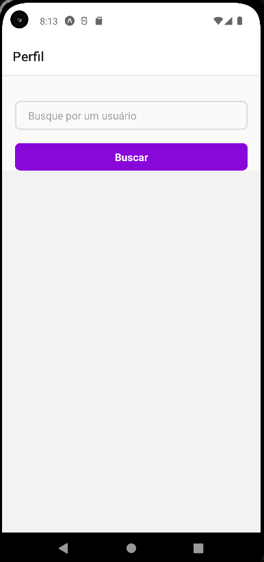
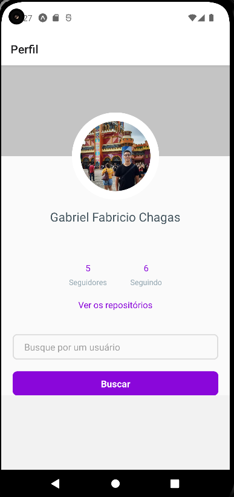
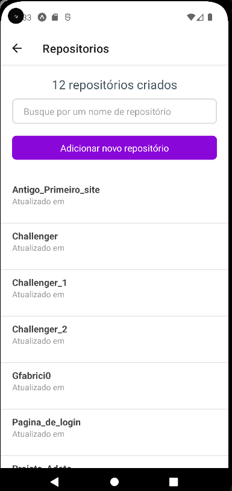

# Inicio
Este é um projeto em que inicialmente foi estudada a utilização de uma Fake API, rodando em localhost. No momento a Fake API foi trocada para a API do GitHub, e neste projeto você pode pesquisar seu perfil no GitHub e olhar seus repositórios.

# Como preparar o ambiente para Android?

É necessário que instalemos 4 programas para a configuração no Windows, que são:

* Chocolatey;
* Node.js na versão LTS;
* JDK 11;
* Expo

# Chocolatey
Após abrir o powershell como administrador é preciso ver se você já tem as permissões para poder prosseguir, com o seguinte comando:

~~~
Get-ExecutionPolicy
~~~

No caso de aparecer uma mensagem escrita "Restricted" (Restrito), é necessário executar outro comando que estará escrito abaixo, caso contrário vá para o próximo comando

~~~
Set-ExecutionPolicy AllSigned
~~~

Se você executou o último comando ou se não apareceu a mensagem de restrição, iremos instalar o chocolatey com este comando abaixo:

~~~
Set-ExecutionPolicy Bypass -Scope Process -Force; [System.Net.ServicePointManager]::SecurityProtocol = [System.Net.ServicePointManager]::SecurityProtocol -bor 3072; iex ((New-Object System.Net.WebClient).DownloadString('https://chocolatey.org/install.ps1'))
~~~

Agora teste se a instalação foi realizada com sucesso:

~~~
choco
~~~

# Node e SDK
Após a instalação do chocolatey é necessário fechar e abrir novamente o powershell, para a instalação do Node.JS e o SDK 11

~~~
choco install -y nodejs-lts openjdk11
~~~

É necessário reiniciar o powershell novamente e reabrir. Após isso, execute os seguintes comandos para conferir a instalação do Node e o SDK

~~~
node -v
~~~

~~~
java -version
~~~

Se tudo estiver correto aparecerá as versões instaladas dos programas.

# Projeto feito em Expo
Para instalar o seguinte comando no CLI global

~~~
$ npm install --global expo-cli
~~~

Após a intalação baixe o repositório em `zip` ou clonando e com o arquivo aberto execute o comando:

~~~ 
npx expo start
~~~

E escolha a opção que deseja abrir o Expo, caso escolha no android é necessário ter o android studio baixado, porém recomendo que abra no browser com o `w`.

# Projeto

## Primeira Tela
Tela de busca do perfil no Github
  

## Segunda Tela
Tela do perfil que mostra a imagem, nome, número de seguidores, número de perfis que está seguindo, opção para ver os repositórios e opção de buscar outro perfil.
  

## Terceira Tela
Tela do repositório que mostra os repositórios do perfil

Acessando um repositório irá perceber, que há botões de `atualizar` e `deletar`, em que na API local funcionavam pelo `CRUD`.
  
